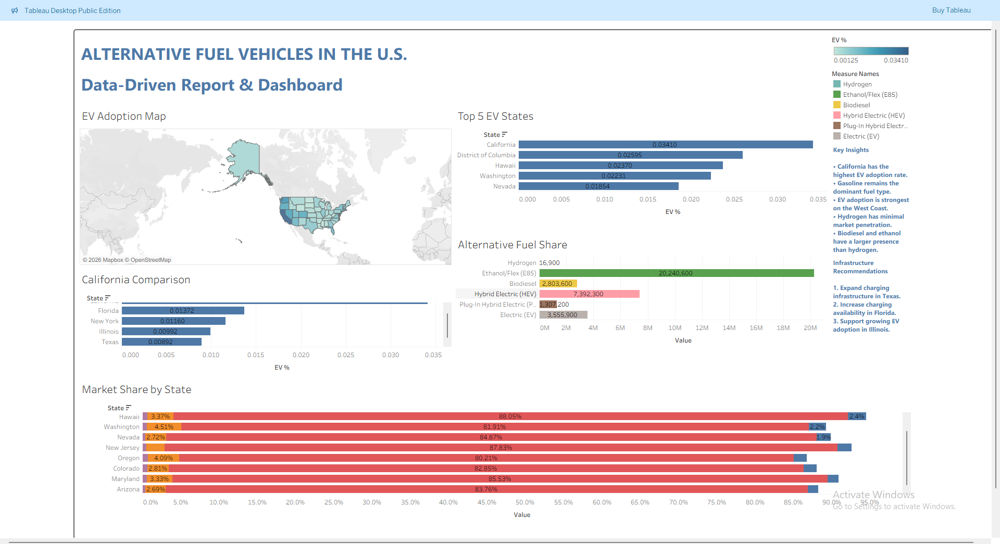

# 🚗 Alternative Fuel Vehicles in the U.S.

A data analysis and visualization project exploring alternative fuel vehicle adoption across the United States.

## 📌 Objective

Analyze the current state of alternative fuel vehicles and identify states that should prioritize EV infrastructure investment.

---

## 🛠 Tech Stack

- Excel
- MySQL
- Tableau

---

## 📂 Dataset

The dataset contains vehicle registrations by state, including:

- Electric Vehicles (EV)
- Plug-in Hybrid Electric Vehicles (PHEV)
- Hybrid Electric Vehicles (HEV)
- Gasoline Vehicles
- Biodiesel
- Ethanol
- Hydrogen
- CNG
- Propane

---

## 📊 Dashboard

Features include:

- Total Registered Vehicles KPI
- EV Adoption KPI
- PHEV KPI
- HEV KPI
- Gasoline KPI
- EV Adoption Map
- Top 5 EV States
- California Comparison
- Market Share by State
- Alternative Fuel Analysis

---

## 🔍 Key Insights

- California leads EV adoption.
- Gasoline vehicles remain dominant.
- West Coast states show higher EV adoption.
- Hydrogen remains a niche fuel.
- Biodiesel and Ethanol have greater adoption than Hydrogen.

---

## 📸 Dashboard Preview



---

## 📁 Repository Structure

```
data/
sql/
tableau/
screenshots/
README.md
```

---

## 👨‍💻 Author

Parth Parkar
